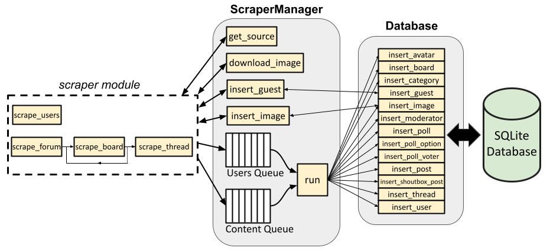

Architecture
============

The architecture and data flow of the ProBoards Forum Scraper are presented
at a high level in the figure below.

Database class
--------------

The :class:`proboards_scraper.database.Database` class serves as an interface
for the SQLite database. It provides a number of convenient methods for
querying the database and inserting items into the database (only insert
methods are shown in the figure).

For example, :meth:`proboards_scraper.database.Database.insert_board` accepts
a dictionary containing parameters corresponding to a board, which it uses to
instantiate a :class:`proboards_scraper.database.Board` object. It queries the
database to determine if the board already exists in the database. If it
doesn't, the new record is inserted into the database. The object is then
returned to the caller. This allows interacting with the database without
worrying about low level ``sqlalchemy`` implementation details (or even lower
level SQL statements).

ScraperManager class
--------------------

The :class:`proboards_scraper.ScraperManager` class contains asynchronous
methods to grab the HTML page source of a URL
(:meth:`proboards_scraper.ScraperManager.get_source`) and download an image
(:meth:`proboards_scraper.ScraperManager.download_image`). It also contains
an asynchronous method :meth:`proboards_scraper.ScraperManager.run` that pops
items from user queue and content queue and adds them and inserts them into the
database.

Why encapsulate these methods in a class instead of allowing them to be
standalone functions?

For starters, incorporating them into the ``ScraperManager`` class enables us
to keep track of the number of HTTP requests made and add delays between HTTP
requests to avoid request throttling by the server.

The ``ScraperManager.run()`` method also ensures that all users are processed
(via the user queue) and added to the database before all other site content,
since most other site content references users in some way. For instance, a
board might have moderators (i.e., users), a thread is started by a user,
posts are made/edited by users, and polls are voted in by users. Each of these
database tables contains a reference (or references) to objects in the users
table; therefore, the users need to exist first before we can populate those
other tables.

Finally, having a ``ScraperManager`` class allows us to store the ``aiohttp``
session, ``selenium`` driver session, and a reference to the ``Database``
class instance in a single place. This way, we only need to pass around the
``ScraperManager`` class instance instead of these other objects, and let it
determine which object should be used for a given task and how to use it.
For example, the caller doesn't need to worry about which ``Database`` insert
method to use. It only needs to put a dictionary containing the necessary
database object parameters into the queue. The ``run()`` method inspects it
and determines which ``Database`` method is needed to insert it into the
database.

The ``ScraperManager`` class also contains two methods that break from the
content queue and ``run()`` pattern:
:meth:`proboards_scraper.ScraperManager.insert_guest`
and :meth:`proboards_scraper.ScraperManager.insert_image`. The reason for
this will be explained below.

Scraper module
--------------

The :mod:`proboards_scraper.scraper` module contains several asynchronous
functions that scrape the site by calling the relevant ``ScraperManager``
methods and parsing/processing the HTML page source. There is a dedicated
function for scraping all users,
:func:`proboards_scraper.scraper.scrape_users`, and there are other
functions for grabbing all other site content.
:func:`proboards_scraper.scraper.scrape_forum` grabs all shoutbox posts and
post smileys (via functions not shown in the figure above), then calls
:func:`proboards_scraper.scraper.scrape_board` on all boards on the main
page. The ``scrape_board()`` recursively scrapes any sub-boards, as well as
all threads belonging to the board via
:func:`proboards_scraper.scraper.scrape_thread` which, in turn, scrapes a
thread (including a poll, if one is associated with the thread, and all the
poll's options and voters) and the thread's posts.

In the figure, the arrows pointing to/from the dashed line representing the
``scraper`` module represents the data flow for each of these functions. In
other words, each function gets the page source (via
:meth:`proboards_scraper.ScraperManager.get_source`), parses it for relevant
information, and adds the appropriate item(s) to the appropriate queue.

Each function can be called individually, even if some of them are recursive.
For example, ``scrape_thread`` can be called with a single thread's URL; it
doesn't *need* to be recursively called by ``scrape_board``.

Guests
------

Guests can be considered a special case of user. Guests are users
who aren't registered on the site (or may be formerly registered users who
have been deleted). There's no user profile associated with a guest, but there
can be posts made by or threads started by guests. Because they aren't
registered users, their profile can't be scraped alongside registered users
from the forum's members page before all other site content is scraped, as
mentioned above.

In other words, guests can be encountered at any time while scraping boards,
threads, posts, etc. To account for this, the ``ScraperManager`` class has a
function specifically for querying and inserting guests into the database,
bypassing the async content queue. If, for instance, a post made by a guest
is encountered by :func:`proboards_scraper.scraper.scrape_thread` while
scraping a thread, :meth:`proboards_scraper.ScraperManager.insert_guest`
is called with the guest's username. If a guest with that username already
exists in the database, their id is retrieved and returned; if the guest does
not already exist, they're inserted into the database and assigned an id, which
is then returned. ``scrape_thread`` can then proceed, assigning the post to the
correct user id (from the User table—see
:class:`proboards_scraper.database.User`)

Since guests aren't registered and don't have an *actual* user id on the forum,
we assign them negative user ids for the purpose of the database. The first
guest encountered is assigned -1, the next -2, and so on.

Images
------

Image metadata is stored in the database Image table (see
:class:`proboards_scraper.database.Image`). Images are unique in that an
image item in the database may also have an image file, saved on disk,
associated with it. The location of the file (if any) on disk is stored in the
``filename`` attribute of the ``Image`` object. To facilitate scraping, the
``ScraperManager`` class has two methods,
:meth:`proboards_scraper.ScraperManager.download_image` and
:meth:`proboards_scraper.ScraperManager.insert_image`, that can be called
to download an image from a URL and insert it into the database, respectively.

This is mainly useful for scraping user profiles. A user's avatar is part of
their profile. While scraping a profile, the avatar is downloaded by calling
the aforementioned ``ScraperManager.download_image`` method, and information
about the file (like its path on disk, its MD5 hash, and its filesize) is
returned. This information is used to construct an ``Image`` object and
insert it into the database via ``ScraperManager.insert_image``, which returns
the id of the image. This id can be linked to an avatar
(see :class:`proboards_scraper.database.Avatar`) and user when they're added
to the content queue per the normal workflow.
